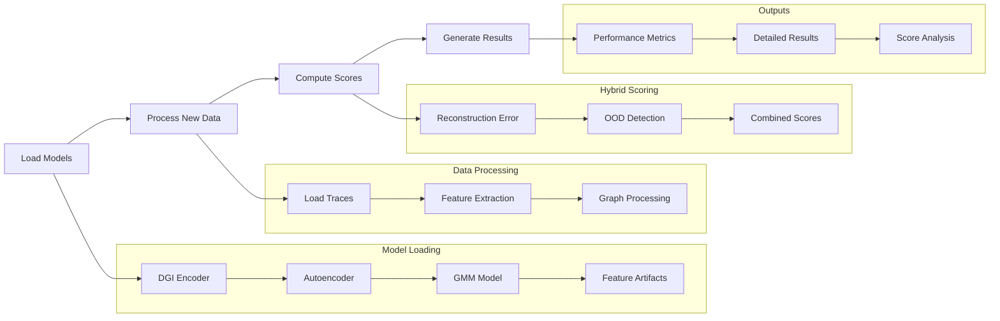

# Quick Start Guide

## Prerequisites

1. **Python 3.8+** installed on your system
2. **OpenAI API Key** for data generation
3. **Required packages** (see requirements.txt)

## Installation

1. **Clone or download** the repository
2. **Install dependencies**:
   ```bash
   pip install -r requirements.txt
   ```

3. **Set up OpenAI API key**:
   ```bash
   export OPENAI_API_KEY="your-api-key-here"
   ```

## Quick Start: Generate Training Data

### Step 1: Generate Normal Traces
```bash
python generate_training_data.py --normal
```
This will create 50 normal agent interaction traces in `training_dataset/normal/`.

### Step 2: Generate Anomaly Traces
```bash
python generate_training_data.py --anomaly
```
This will create 2 traces for each of the 15 anomaly types in `training_dataset/anomaly/`.

### Step 3: Generate Both (Recommended)
```bash
python generate_training_data.py
```
This generates both normal and anomaly data in one command.

## Quick Start: Generate Evaluation Data

### Step 1: Generate Financial Domain Evaluation Data
```bash
python generate_eval_data.py --categories ALL --num_traces 15
```
This will create 15 traces for each category (Normal + 15 anomaly types) in `eval_dataset/`.

### Step 2: Generate Specific Categories
```bash
python generate_eval_data.py --categories Normal "Tool Calling Error" "Agent Handoff Error" --num_traces 10
```
This generates 10 traces for each specified category.

## Quick Start: Train Anomaly Detection Model

### Step 1: Run Training Pipeline
```bash
python training_pipeline.py
```

This will:
- Load the generated training data
- Convert traces to graphs
- Extract motifs and features
- Train DGI encoder and autoencoder
- Generate comprehensive visualizations
- Save trained models

### Step 2: Check Results
After training completes, check the outputs:

- **Models**: `training/model/`
- **Visualizations**: `training/visuals/`
- **Training logs**: Console output

## Quick Start: Evaluate Model Performance

### Evaluation Overview



### Step 1: Run Evaluation Pipeline
```bash
python eval_pipeline.py
```

This will:
- Load trained models from `training/model/`
- Load evaluation data from `eval_dataset/`
- Compute hybrid anomaly scores (reconstruction + OOD detection)
- Generate comprehensive evaluation metrics
- Save detailed results to `eval/`

### Step 2: Check Evaluation Results
After evaluation completes, check the outputs:

- **Evaluation results**: `eval/evaluation_results.json`
- **Detailed results**: `eval/detailed_results.json`
- **Summary statistics**: `eval/summary_statistics.json`

## Expected Output

### Directory Structure
```
modules/
├── training_dataset/
│   ├── normal/          # Generated normal traces
│   └── anomaly/         # Generated anomaly traces
├── eval_dataset/
│   ├── normal/          # Evaluation normal traces
│   └── anomaly/         # Evaluation anomaly traces
├── training/
│   ├── model/           # Trained models
│   ├── visuals/         # Generated plots
│   ├── checkpoints/     # Training checkpoints
│   └── cache/           # Cached computations
└── eval/                # Evaluation results
    ├── evaluation_results.json
    ├── detailed_results.json
    └── summary_statistics.json
```

### Key Files Generated
- `training/model/autoencoder_final.pth` - Trained autoencoder
- `training/model/dgi_encoder_final.pth` - Trained DGI encoder
- `training/visuals/confusion_matrix.png` - Model performance
- `training/visuals/roc_curve.png` - ROC curve analysis
- `eval/evaluation_results.json` - Evaluation performance metrics

## Customization

### Adjust Training Data Generation
Edit `generate_training_data.py` to modify:
- Number of traces: `NUM_NORMAL`, `NUM_ANOMALY_PER_TYPE`
- Available tools/agents: `AVAILABLE_TOOLS`, `AVAILABLE_AGENTS`
- Anomaly types: `ANOMALY_TYPES`

### Adjust Evaluation Data Generation
Edit `generate_eval_data.py` to modify:
- Number of traces: `--num_traces` parameter
- Categories: `--categories` parameter
- Parallel workers: `--max_workers` parameter

### Adjust Training Parameters
Edit `training_pipeline.py` to modify:
- Training epochs: `EPOCHS_MOTIF`, `AUTOENCODER_EPOCHS`
- Batch size: `BATCH_SIZE_MOTIF`
- Learning rate: `LEARNING_RATE`
- Model architecture: Hidden dimensions, layers, etc.

## Common Use Cases

### 1. Quick Experiment
```bash
# Generate minimal datasets
python generate_training_data.py --normal
python generate_training_data.py --anomaly
python generate_eval_data.py --categories Normal "Tool Calling Error" --num_traces 5

# Train with default settings
python training_pipeline.py

# Evaluate on new data
python eval_pipeline.py
```

### 2. Production Training
```bash
# Generate larger datasets
# Edit NUM_NORMAL = 200, NUM_ANOMALY_PER_TYPE = 5 in generate_training_data.py
python generate_training_data.py
python generate_eval_data.py --categories ALL --num_traces 20

# Train with caching enabled
python training_pipeline.py --cache-prefix production_v1

# Evaluate performance
python eval_pipeline.py
```

### 3. Research/Development
```bash
# Clear cache for fresh start
python training_pipeline.py --clear-cache

# Try different threshold methods
python training_pipeline.py --threshold-method percentile_95
python training_pipeline.py --threshold-method mean_plus_2std

# Test cross-domain generalization
python generate_eval_data.py --categories ALL --num_traces 15
python eval_pipeline.py
```

## Troubleshooting

### Common Issues

1. **OpenAI API Error**
   ```
   ERROR: OpenAI API key not found!
   ```
   **Solution**: Set your API key: `export OPENAI_API_KEY="your-key"`

2. **Memory Issues**
   ```
   CUDA out of memory
   ```
   **Solution**: Reduce batch size in `training_pipeline.py`

3. **Cache Issues**
   ```
   Cache corruption detected
   ```
   **Solution**: Clear cache: `python training_pipeline.py --clear-cache`

4. **Missing Dependencies**
   ```
   ModuleNotFoundError: No module named 'torch_geometric'
   ```
   **Solution**: Install missing packages: `pip install torch-geometric`

5. **Model Loading Errors**
   ```
   Error: model_config.json not found in model directory
   ```
   **Solution**: Run training pipeline first: `python training_pipeline.py`

### Performance Tips

1. **Use Caching**: Don't disable cache unless debugging
2. **GPU Usage**: The system automatically uses GPU if available
3. **Batch Size**: Adjust based on your hardware capabilities
4. **Data Size**: Start with smaller datasets for testing
5. **Parallel Generation**: Use `--max_workers` for faster data generation

## Next Steps

After successful training and evaluation:

1. **Analyze Results**: Check visualizations in `training/visuals/`
2. **Review Evaluation**: Check `eval/evaluation_results.json`
3. **Compare Performance**: Review confusion matrix and ROC curves
4. **Customize Models**: Adjust architecture or training parameters
5. **Scale Up**: Increase dataset size for better performance
6. **Deploy**: Use trained models for real-time anomaly detection

## Support

- Check the main `README.md` for detailed documentation
- Review `TECHNICAL_DOCS.md` for implementation details
- Examine generated visualizations for model insights
- Monitor console output for training progress and errors

## Example Output

Successful training should show:
```
🚀 Starting Anomaly Detection Pipeline...
📱 Using device: cpu
⚙️  Cache setting: Enabled

📂 Loading trace data...
✅ Loaded 50 normal traces (missing metadata: 0)
✅ Loaded 30 anomaly traces (missing metadata: 0)

🔄 Splitting normal data into train/test...
✅ Normal train: 40, test: 10

🔄 Converting traces to graphs...
✅ Graphs: train 40, test 10, anomaly 30

🔄 Training DGI encoder...
✅ DGI encoder training completed and saved

🔄 Training autoencoder...
✅ Autoencoder training completed and saved

🎉 Pipeline completed successfully!
📊 Final Results:
   Accuracy: 0.9250
   Precision: 0.9000
   Recall: 0.9000
   F1 Score: 0.9000
   AUC-ROC: 0.9500
   AUC-PR: 0.9500
   Threshold: 0.123456
```

Successful evaluation should show:
```
Using device: cpu
Loaded SentenceTransformer successfully
Loaded model configuration: {'dgi_encoder': {...}, 'autoencoder': {...}}
Loaded DGI encoder from training/model/dgi_encoder_final.pth (input_dim: 384)
Loaded autoencoder from training/model/autoencoder_final.pth (input_dim: 448)
Loaded feature artifacts: keep mask (25 features), scaler
Loaded 15 new normal traces (missing metadata: 0)
Loaded 30 new anomaly traces (missing metadata: 0)
New graphs: normal 15, anomaly 30
Computing anomaly scores for 45 samples...
Score range: 0.0123 to 0.4567

============================================================
EVALUATION RESULTS ON NEW DATASET
============================================================
Dataset: 15 normal, 30 anomaly samples
Model: 448-dim autoencoder
Threshold: 0.1234
============================================================
ACCURACY: 0.9333
PRECISION: 0.9000
RECALL: 0.9333
F1: 0.9167
AUC_ROC: 0.9556
AUC_PR: 0.9444
```

This indicates a well-performing anomaly detection model with good generalization! 